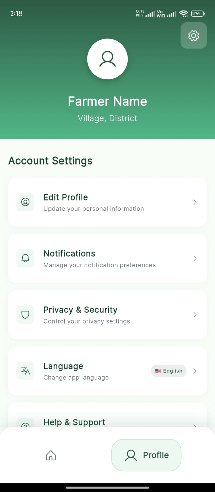

# 🌿 Setu App - Rural Registration & Services

<div align="center">
  
  
  
  
</div>

<div align="center">
  <h3>🚀 Your Rural Registration Companion</h3>
  <p><em>Bridging the gap between rural communities and government services</em></p>
</div>

---

## 📱 Download & Try the App

<div align="center">
  <a href="https://drive.google.com/file/d/1enDU-5mVnJ5BVj_doiVc3CGp4QawYO3c/view?usp=drivesdk">
    
  </a>
</div>

---

## ✨ Features

### 🏠 **Multi-Language Support**
- **English** - Global accessibility
- **Hindi** - National language support
- **Marathi** - Regional language integration

### 🎯 **Quick Actions Dashboard**
- **My Applications** - Track your submissions
- **Pending Applications** - Monitor application status
- **Contact Support** - Get help when needed
- **Verified Applications** - View approved requests

### 🏛️ **Government Scheme Registration**
- **Land Acquisition Calculation** - Property assessment tools
- **Court Commission Cases** - Legal matter management
- **Court Allocation Processing** - Case tracking system
- **Government Census** - Data management portal

### 📊 **Smart Survey System**
- **Step-by-step Process** - Guided application flow
- **Document Upload** - Secure file management
- **Identity Verification** - Aadhar card integration
- **Real-time Progress** - Application status tracking

---

## 🛠️ Technology Stack

| **Frontend** | **Backend** | **Database** |
|:---:|:---:|:---:|
|  |  |  |
| **Cross-platform** | **Express.js** | **Relational DB** |
| **Responsive UI** | **REST APIs** | **Data Security** |

---

## 📸 App Screenshots

<div align="center">
  <table>
    <tr>
      <td align="center">
        <br/>
        <b>🔐 Login Screen</b>
      </td>
      <td align="center">
        <br/>
        <b>🌐 Language Selection</b>
      </td>
      <td align="center">
        <br/>
        <b>🏠 Dashboard</b>
      </td>
    </tr>
    <tr>
      <td align="center">
        <br/>
        <b>🏛️ Government Schemes</b>
      </td>
      <td align="center">
        <br/>
        <b>👤 Profile Settings</b>
      </td>
      <td align="center">
        <br/>
        <b>📊 Survey System</b>
      </td>
    </tr>    <tr>
      <td align="center">
        <br/>
        <b>👤 User Lifecycle</b>
      </td>
      <td align="center">
        <br/>
        <b>🌐 Language Preference</b>
      </td>
    </tr>
  </table>
</div>

---

## 🚀 Key Highlights

### 👨‍💼 **For Rural Users**
- **Simplified Interface** - Easy navigation for all age groups
- **Vernacular Support** - Native language comfort
- **Offline Capability** - Works in low connectivity areas
- **Document Scanner** - Built-in camera integration

### 🏛️ **For Government Services**
- **Digital Registration** - Paperless application process
- **Real-time Tracking** - Application status updates
- **Secure Storage** - Encrypted document management
- **Analytics Dashboard** - Performance insights

### 💼 **For Administrators**
- **Application Management** - Streamlined approval workflow
- **User Verification** - Identity validation system
- **Report Generation** - Comprehensive analytics
- **Multi-tier Access** - Role-based permissions

---

## 🔧 Installation & Setup

### Prerequisites
```bash
Flutter SDK >= 3.0.0
Node.js >= 16.0.0
MySQL >= 8.0
```

### Clone Repository
```bash
git clone https://github.com/alonevaibhav/setu-app.git
cd setu-app
```

### Frontend Setup
```bash
flutter pub get
flutter run
```

### Backend Setup
```bash
cd backend
npm install
npm start
```

---

## 🎯 Project Goals

> **Mission:** To digitalize rural registration processes and make government services accessible to every citizen, regardless of their technical expertise or geographical location.

### 🌟 **Impact Areas**
- **Digital Inclusion** - Bringing technology to rural areas
- **Government Transparency** - Clear application processes
- **Time Efficiency** - Reduced paperwork and waiting times
- **Accessibility** - Multi-language and user-friendly design

---

## 📊 Application Flow


---

## 🤝 Contributing

We welcome contributions! Please feel free to submit a Pull Request. For major changes, please open an issue first to discuss what you would like to change.

### Development Guidelines
- Follow Flutter best practices
- Write clean, documented code
- Test your changes thoroughly
- Update documentation as needed

---

## 📞 Support & Contact

<div align="center">

[](https://github.com/alonevaibhav/setu-app/issues)
[](mailto:your.email@example.com)

</div>

---

## 📜 License

This project is licensed under the MIT License - see the [LICENSE](LICENSE) file for details.

---

<div align="center">
  <h3>🙏 Thank you for supporting rural digitalization!</h3>
  <p>Made with ❤️ for rural communities</p>

⭐ **Star this repository if you found it helpful!** ⭐
</div>